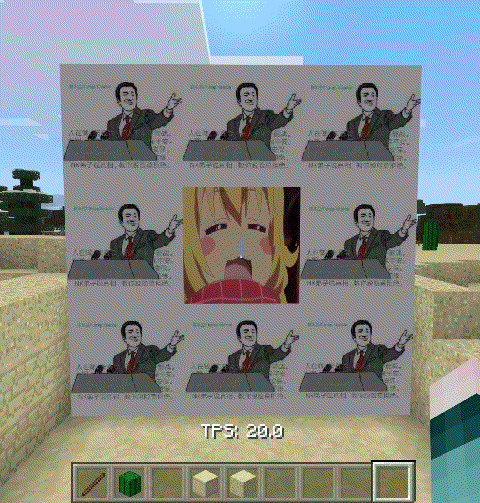
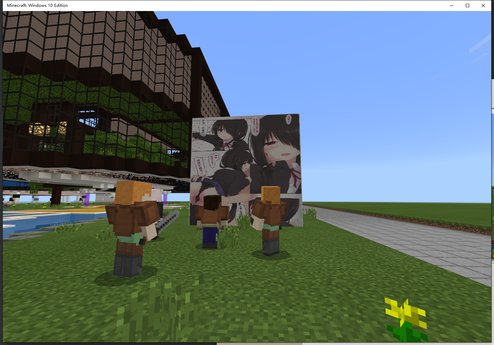

# MyMap

MyMap plugin for [Nukkit](https://github.com/nukkit/nukkit). Show your gif images on the server!

## Description

This plugin allows you to show static images, gif images, multi images(Several images that are alternated) on your server.  
Screenshots are at the end of this README.

## Download
- [via TeamCity](http://mamoe.net:2333/viewType.html?buildTypeId=Mymap_Build)

## Usage

1. Install the plugin into your server. And join in the server.
2. Create a rectangle in a world(Any one, not just the main world).
3. Use the command `/mymap add <id>` to make the rectangle you just created become a frame. The rectangle will be replaced with frame blocks by the plugin, which are not allowed to be removed. When you want to remove that, ues the command `/mymap remove <id>` first.
4. Put your image files into `plugins/MyMap/images/`.
5. Use the command `/mymap setpicture <id> <imageFileName>` to change the picture
   in the frame. (imageFileName not includes path)
6. The plugin will start to fill in the frame. Enjoy it!

## Tips

- If you want to change the picture, use the command `/mymap setpicture <id> <imageFile>`.
- Any OP can long-touch(Right-click for Win10) a frame to look up `id` of the frame.
- This plugin supports languages in 简体中文(Chinese Simplified) and English
- This plugin will automatically set the language(based on your system language)
- You can change the language in config.yml

## Q&A

- How to set GIF image?  
  The same way as static images. The plugin will automatically play them.
- How to set Multi images?  
  Create a folder under plugins/MyMap/images, put images in it.(Needs static picture, dynamic GIF only displays the first frame).  
  Name of picture decides how long to display. (Not includeding the suffix, exploding by "-", the last one of which is the display time)  
  Examples:
  - pic-3000.jpg  displays 3000ms = 3s
  - img-500.png  displays 500ms = 0.5s
  - -3000.bmp  displays 3000ms = 3s

  PS: If the filename has no or more than 1 "-", or the number is invalid(negative), the plugin will use default display time 3000ms=3s.

## Screenshots

  

